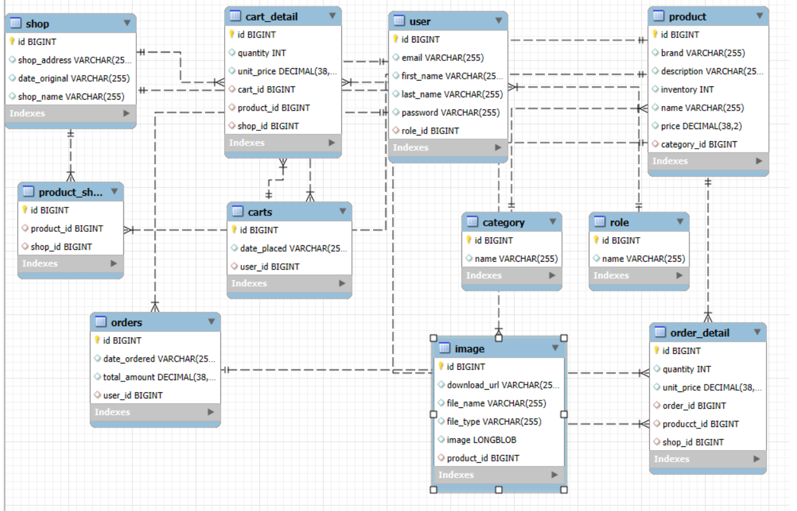

# Shopping Cart E-Commerce Backend

## Project Description

A comprehensive RESTful API backend for an e-commerce shopping cart system built with Spring Boot. This application provides robust functionality for managing products, users, shopping carts, and order processing with secure authentication and authorization mechanisms.

## Technology Stack

| Technology | Version |
|------------|---------|
| Java | 17+ |
| Spring Boot | 3.2.x |
| Spring Framework | 6.1.x |
| Spring Security | 6.2.x |
| Spring Data JPA | 3.2.x |
| Hibernate | 6.4.x |
| MySQL | 8.0+ |
| Maven | 3.9+ |

## Database Schema

### Entity Relationship Overview

```
User ──────────────── Role
 │                    
 ├─── Cart ─────────── CartDetail ──── Product
 │                                       │
 └─── Order ────────── OrderDetail ──────┤
                                         │
                    Category ────────────┤
                                         │
                    Image ───────────────┘
```

### Core Entities

- **User**: Customer information and authentication details
- **Role**: User authorization levels (ADMIN, CUSTOMER, etc.)
- **Product**: Product catalog with details and pricing
- **Category**: Product categorization and organization
- **Image**: Product images and media management
- **Cart**: Shopping cart for logged-in users
- **CartDetail**: Individual items within a shopping cart
- **Order**: Completed purchase transactions
- **OrderDetail**: Line items within an order

## Key Features

### Authentication & Security
- JWT-based authentication
- Role-based access control (RBAC)
- Secure password encryption with BCrypt
- Protected API endpoints

### Shopping Cart Management
- Add/Remove products from cart
- Update product quantities
- Cart persistence for logged-in users
- Cart-to-order conversion

### Product Management
- CRUD operations for products
- Category-based product organization
- Image upload and management
- Product search and filtering

### Order Processing
- Order creation from cart
- Order history tracking
- Order status management
- Detailed order reporting

### User Management
- User registration and authentication
- Profile management
- Role assignment
- Account activation/deactivation

## Project Structure

```
src/main/java/com/project/shoppingcart/
├── config/              # Configuration classes
│   ├── SecurityConfig.java
│   └── JwtConfig.java
├── controller/          # REST API endpoints
│   ├── AuthController.java
│   ├── ProductController.java
│   ├── CartController.java
│   └── OrderController.java
├── service/             # Business logic layer
│   ├── UserService.java
│   ├── ProductService.java
│   ├── CartService.java
│   └── OrderService.java
├── repository/          # JPA repositories
│   ├── UserRepository.java
│   ├── ProductRepository.java
│   ├── CartRepository.java
│   └── OrderRepository.java
├── entity/              # Database entities
│   ├── User.java
│   ├── Role.java
│   ├── Product.java
│   ├── Category.java
│   ├── Image.java
│   ├── Cart.java
│   ├── CartDetail.java
│   ├── Order.java
│   └── OrderDetail.java
├── dto/                 # Data Transfer Objects
├── exception/           # Custom exceptions
├── security/            # Security utilities
└── util/                # Helper classes
```

## Installation & Setup

### Prerequisites
- Java 17 or higher
- Maven 3.9+
- MySQL 8.0+
- IDE (IntelliJ IDEA, Eclipse, VS Code)

### Database Setup

1. Create MySQL database:

```sql
CREATE DATABASE shopping_cart_db;
CREATE USER 'shopping_user'@'localhost' IDENTIFIED BY 'password';
GRANT ALL PRIVILEGES ON shopping_cart_db.* TO 'shopping_user'@'localhost';
FLUSH PRIVILEGES;
```

2. Update `application.properties`:

```properties
spring.datasource.url=jdbc:mysql://localhost:3306/shopping_cart_db
spring.datasource.username=shopping_user
spring.datasource.password=password
spring.jpa.hibernate.ddl-auto=update
spring.jpa.database-platform=org.hibernate.dialect.MySQL8Dialect
```

### Running the Application

1. **Clone the repository**

```bash
git clone <repository-url>
cd shopping-cart-backend
```

2. **Install dependencies**

```bash
mvn clean install
```

3. **Run the application**

```bash
mvn spring-boot:run
```

4. **Access the application**
- API Base URL: `http://localhost:8080`
- Health Check: `http://localhost:8080/actuator/health`

## API Documentation

### Authentication Endpoints
- `POST /api/admin/registrations` - User registration
- `POST /api/auth/login` - User login

### Product Endpoints
- `GET /api/products` - Get all products
- `GET /api/products/{id}` - Get product by ID
- `POST /api/products` - Create new product (Admin)
- `PUT /api/products/{id}` - Update product (Admin)
- `DELETE /api/products/{id}` - Delete product (Admin)

### Cart Endpoints
- `GET /api/cart` - Get user's cart
- `POST /api/cart/items` - Add item to cart
- `PUT /api/cart/items/{id}` - Update cart item quantity
- `DELETE /api/cart/items/{id}` - Remove item from cart

### Order Endpoints
- `POST /api/orders` - Create order from cart
- `GET /api/orders` - Get user's order history
- `GET /api/orders/{id}` - Get order details

## Testing

Run the test suite:

```bash
mvn test
```

Run with coverage:

```bash
mvn test jacoco:report
```

## Security Features

- **JWT Authentication**: Stateless authentication using JSON Web Tokens
- **Password Encryption**: BCrypt hashing for secure password storage
- **Role-Based Access**: Different access levels for admins and customers
- **CORS Configuration**: Cross-origin resource sharing setup
- **Input Validation**: Request validation using Bean Validation
- **Exception Handling**: Global exception handling with proper error responses

## Configuration

### Environment Variables

```properties
# Database Configuration
DB_HOST=localhost
DB_PORT=3306
DB_NAME=shopping_cart_db
DB_USERNAME=shopping_user
DB_PASSWORD=password

# JWT Configuration
JWT_SECRET=your-256-bit-secret-key
JWT_EXPIRATION=86400000

# File Upload
MAX_FILE_SIZE=10MB
UPLOAD_PATH=/uploads/images
```

## Contributing

1. Fork the repository
2. Create a feature branch (`git checkout -b feature/amazing-feature`)
3. Commit your changes (`git commit -m 'Add amazing feature'`)
4. Push to the branch (`git push origin feature/amazing-feature`)
5. Open a Pull Request


## Authors

- [MyGitHub](https://github.com/trananhtuuuuuuuu)

---

**Happy Coding!**